# Machine Learning Algorithm Comparison

Comparing five machine learning algorithms on a dataset using different train-test split values.

## Algorithms

### 1. CatBoost

Test Size: 0.2

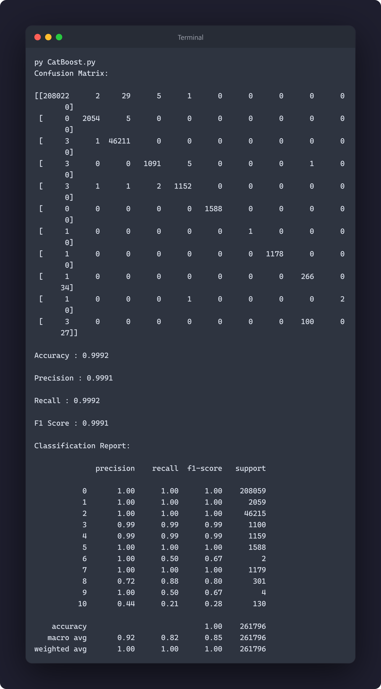

Test Size: 0.4

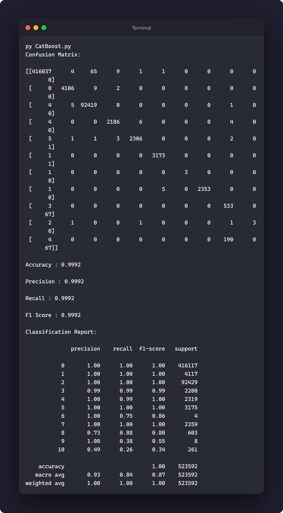

Test Size: 0.6

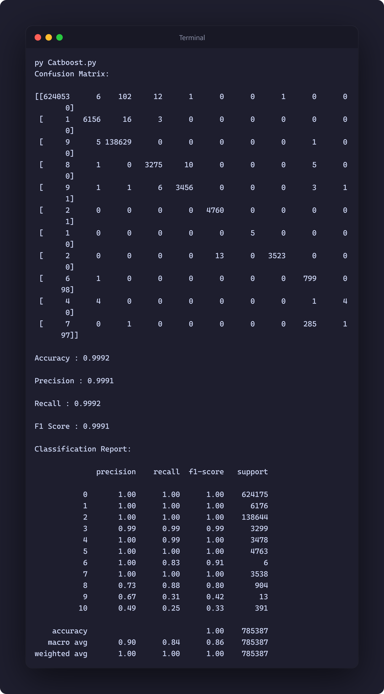

---

### 2. AdaBoost

Test Size: 0.2

Test Size: 0.4

Test Size: 0.6

---

### 3. K-Nearest Neighbors

Test Size: 0.2

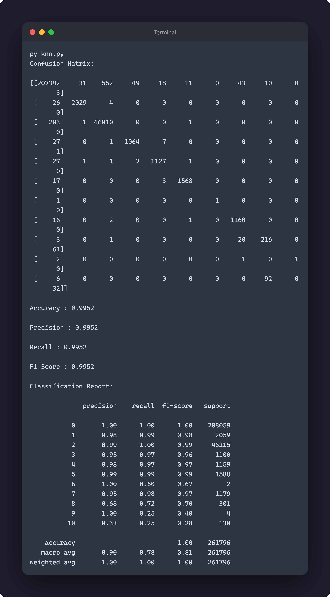

Test Size: 0.4

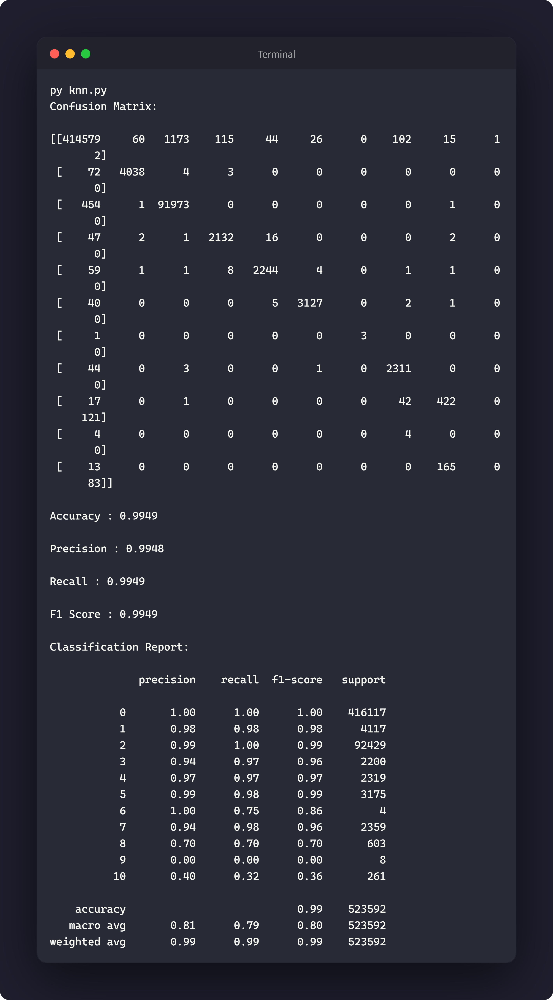

Test Size: 0.6

---

### 4. Naive Bayes

Test Size: 0.2

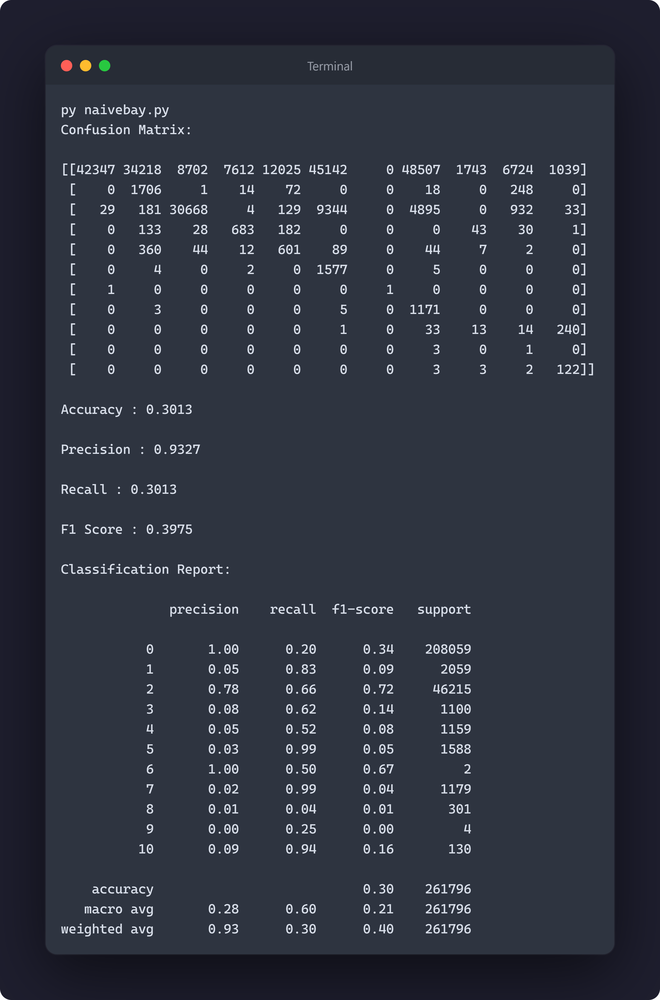

Test Size: 0.4

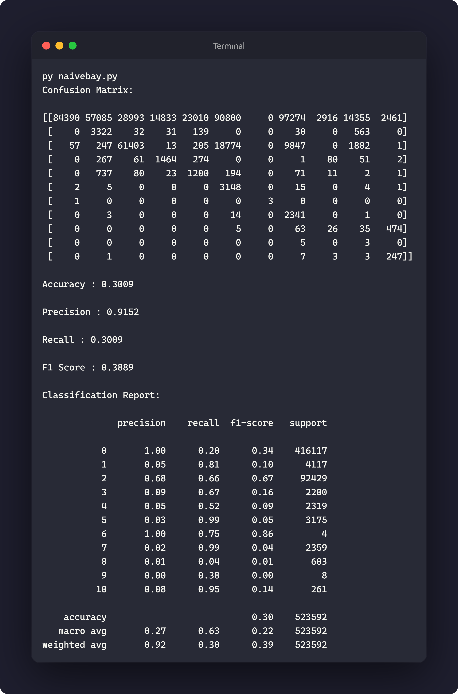

Test Size: 0.6

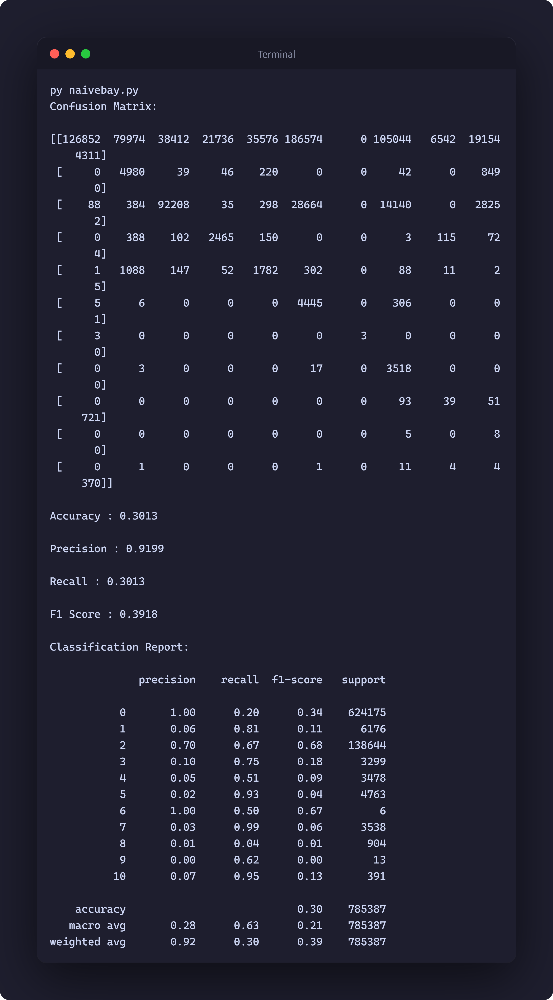

---

### 5. Support Vector Machine

Test Size: 0.2

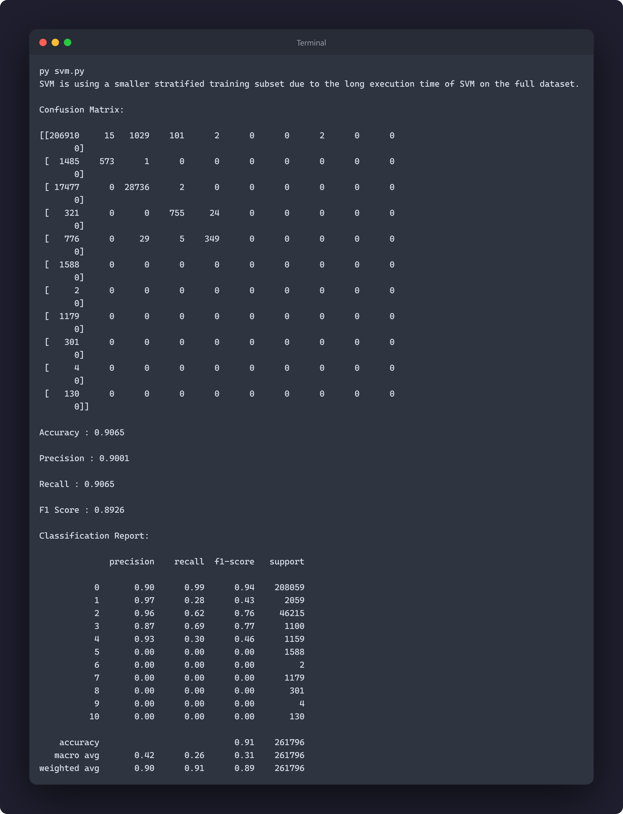

Test Size: 0.4

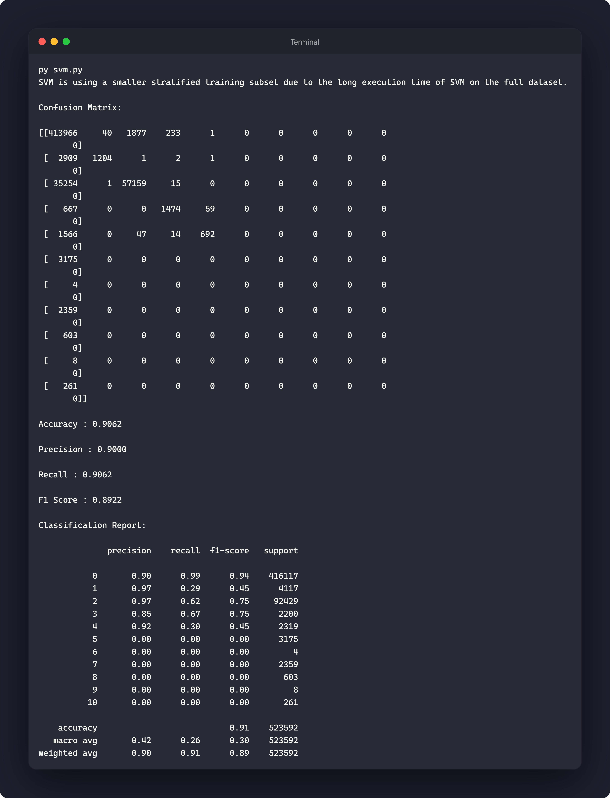

Test Size: 0.6

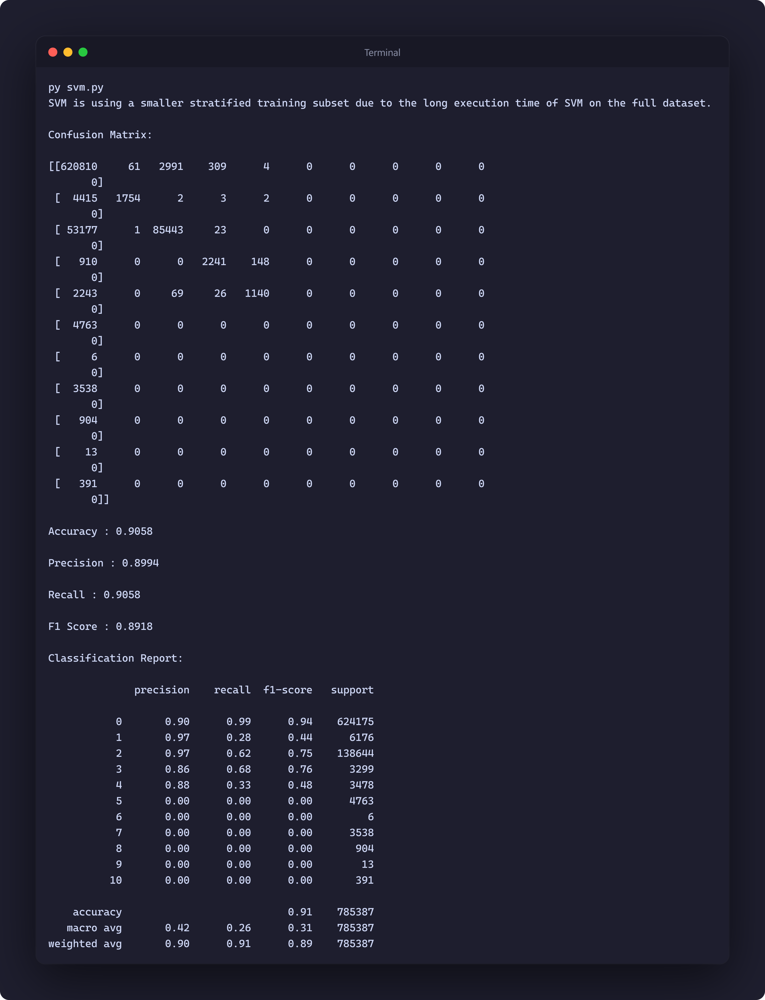

